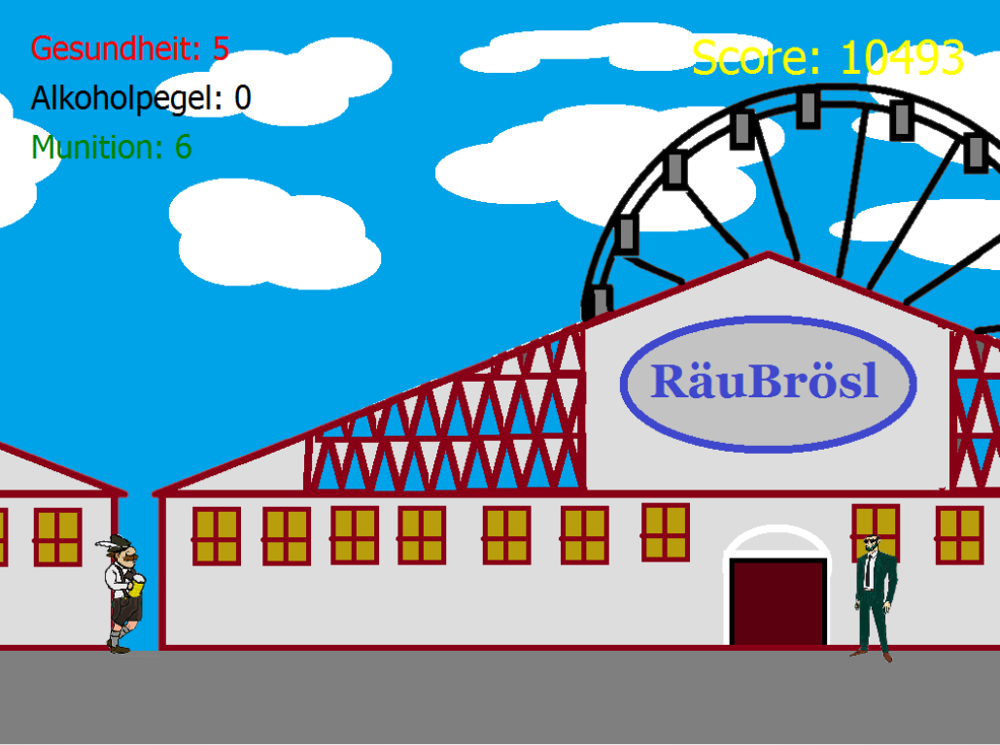

# Oktoberfest-Run

 
Oktoberfest-Run, or in Bavarian language Wiesn-Run, is a C++ Game that allows the user to experience the Oktoberfest on the own PC. 
 
 
For developing and testing following environments are required:

 - Ubuntu with QT Version 5.2.1
 - Debian with QT Version 5.3.2
 - Windows with QT Version 5.4.1

Notes for compiling under Linux:
The PortAudio audio library must be present for compiling. Strictly speaking, it should be version 19+svn20111121-1. Under Debian/Ubuntu it is sufficient to install the portaudio19-dev package. Then under the path /usr/lib/x86_64-linux-gnu you should find the file libportaudiocpp.so. Stricter runtime rules apply in release mode than in debug mode. Due to a bug in the Linux version of the portaudio library, the game cannot be run on some Linux flavors when compiled in release mode. In this case the game must be compiled in debug mode. -> In audiocontrol.cpp messages are output before and after the call of the library function Pa_Initialize(). In debug mode the messages are output from and after the call and the game is started. In release mode, on some systems only the message before Pa_Initialize() is output.

Since the used audio files have to be copied into the build folder to start the program, a small change of the build step "Make" is required. Please add the command line argument "install" to the build step "Make" in the QTCreator.
